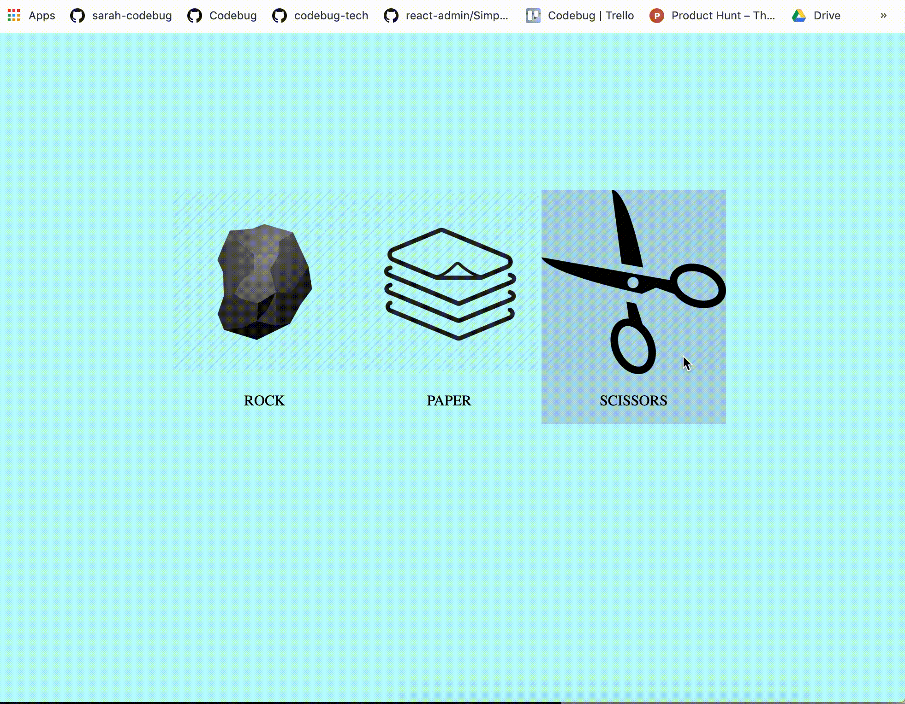

# Rock Paper Scissors
Example of how a Rock Paper Scissors Project could look...

### Some Steps To Help
- Find images for rock, paper, and scissors
- Create an `div` that has an `img` and a `p` inside it like this for each choice (Rock, Paper, Scissors) :

        

          
          
ROCK

        

- Style using the class `choice-div`s to make it so that the background color changes when you hover over the div. This [link](https://www.w3schools.com/cssref/sel_hover.asp) will help you!
- Inside your `script.js` write a click event for each choice. It will look something like this:
        
          $("#rock").click(function(event){
              // write your code to determine who won when the user picks rock here

          })
